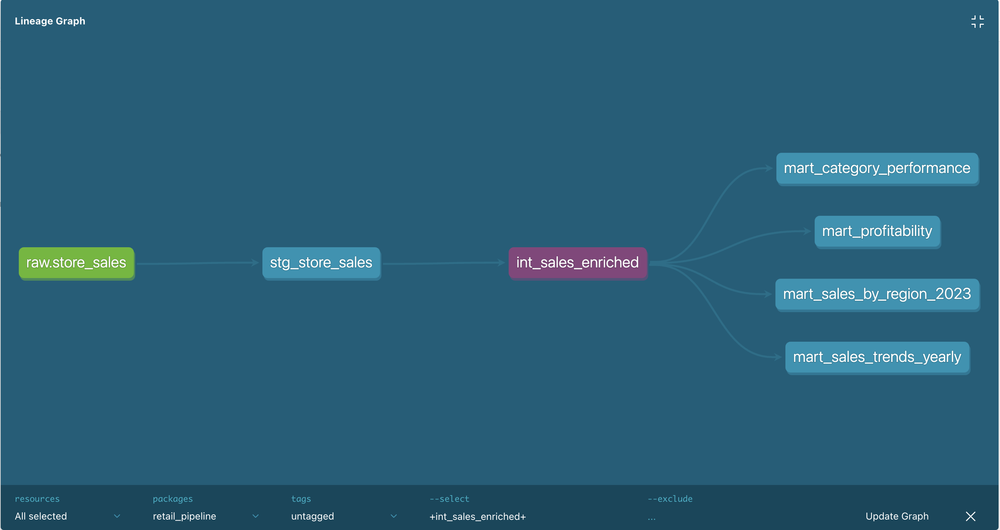
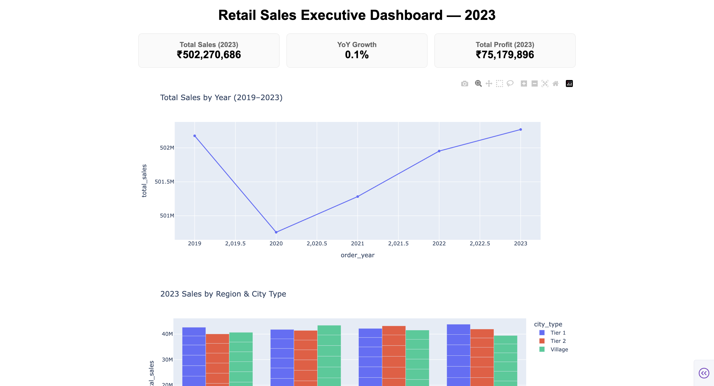
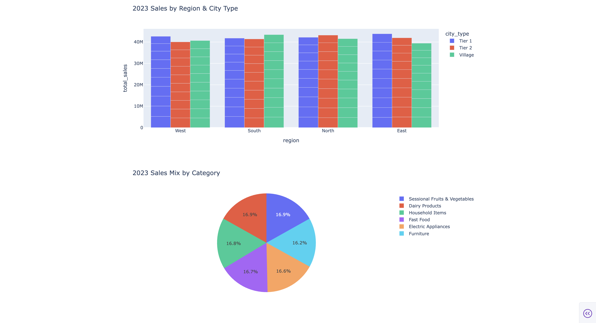

# Retail Sales Analytics Pipeline (2019–2023, India)

End-to-end ELT pipeline — Snowflake + dbt + Airflow + Plotly Dash — built on the
[Indian Store Data](https://www.kaggle.com/datasets/abuhumzakhan/store-data)
dataset (100K rows, 2019–2023).

## Architecture

```
CSV (Kaggle) → Snowflake (raw) → dbt (staging → intermediate → marts) → Airflow (daily orchestration) → Dash dashboard
```



## Models

| Layer | Model | Purpose |
|---|---|---|
| staging | `stg_store_sales` | Typed, cleaned raw transactions |
| intermediate | `int_sales_enriched` | Adds net sales, profit margin, quarter, 2023 flag |
| marts | `mart_sales_trends_yearly` | YoY revenue/profit/growth, 2019–2023 |
| marts | `mart_sales_by_region_2023` | 2023-only regional breakdown (executive view) |
| marts | `mart_category_performance` | Category/sub-category performance by year |
| marts | `mart_profitability` | Profit margin by category and discount band |

All models are tested with dbt's built-in test suite (`not_null`, `unique`,
`accepted_values`) — see `models/*/schema.yml`.

## Dashboard





KPI cards (total sales, YoY growth, total profit), a multi-year sales trend
line, a regional/city-type breakdown, and a category sales-mix chart — all
reading live from the Snowflake marts.

## Orchestration

The Airflow DAG (`airflow/retail_sales_dag.py`) runs `dbt run` followed by
`dbt test` on a daily schedule, so the marts and dashboard always reflect
freshly validated data.

## Setup

### 1. Dataset
Download `store_sales_data.csv` from
[Kaggle](https://www.kaggle.com/datasets/abuhumzakhan/store-data). Check the
real header row against `snowflake_setup.sql` and adjust column names there
if they differ.

### 2. Snowflake
1. Sign up for a [free trial](https://signup.snowflake.com/).
2. Open a SQL worksheet, paste in `snowflake_setup.sql`, run it section by section.
3. Use Snowsight's **Load Data** button to upload the CSV into `RAW.STORE_SALES`.
4. Confirm the row count with the sanity-check query at the bottom of the script.

### 3. dbt
```bash
pip install -r requirements.txt
mkdir -p ~/.dbt
cp dbt_retail/profiles_template.yml ~/.dbt/profiles.yml
# edit ~/.dbt/profiles.yml with your own Snowflake account/user/password
cd dbt_retail
dbt debug      # confirms the connection works
dbt run        # builds staging -> intermediate -> marts
dbt test       # runs the schema tests
dbt docs generate && dbt docs serve   # view the lineage graph in your browser
```

### 4. Airflow
```bash
brew install astro
mkdir airflow_project && cd airflow_project
astro dev init
cp -r ../dbt_retail .
cp ../airflow/retail_sales_dag.py dags/
echo "dbt-core" >> requirements.txt
echo "dbt-snowflake" >> requirements.txt
mkdir -p include/.dbt && cp ~/.dbt/profiles.yml include/.dbt/
astro dev start
# open the Airflow UI link printed in the terminal, then trigger the DAG
```

### 5. Dashboard
```bash
export SNOWFLAKE_USER=<your_username>
export SNOWFLAKE_PASSWORD=<your_password>
export SNOWFLAKE_ACCOUNT=<your_account_locator>
python dashboard/app.py
# open http://127.0.0.1:8050
```

## Stack

Snowflake · dbt · Airflow (Astronomer) · Python · Plotly Dash · pandas
